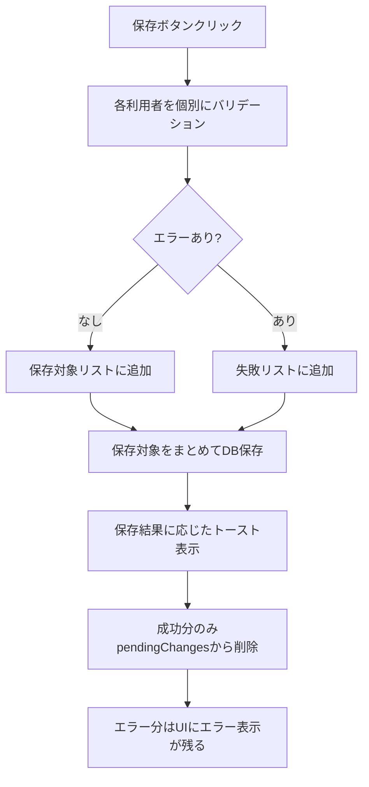

# 業務日誌の個別保存機能 - ウォークスルー

## 概要
業務日誌の保存処理を改善し、一人の入力不備が他の利用者の保存をブロックする問題を解決しました。

---

## 変更したファイル

### 1. [daily-report-validation.ts](file:///c:/Users/ktana/.gemini/antigravity/playground/infrared-rocket/lib/daily-report-validation.ts)

render_diffs(file:///c:/Users/ktana/.gemini/antigravity/playground/infrared-rocket/lib/daily-report-validation.ts)

**変更内容:**
- **A2a（日中活動エラー）**: `other_welfare_service` フィールドにもエラーを追加。GH・日中活動・その他福祉サービスの3項目すべてが赤くハイライトされるように
- **A3（夜間エラー）**: 4項目（GH泊、救急搬送、入院、外泊）すべてにエラーを追加

---

### 2. [daily-report-grid.tsx](file:///c:/Users/ktana/.gemini/antigravity/playground/infrared-rocket/components/features/daily-report/daily-report-grid.tsx)

render_diffs(file:///c:/Users/ktana/.gemini/antigravity/playground/infrared-rocket/components/features/daily-report/daily-report-grid.tsx)

**変更内容:**
- 保存処理を個別バリデーション・保存に変更
- 各利用者ごとにバリデーションを実行し、エラーのない人だけを保存
- 保存成功した利用者のみ `pendingChanges` から削除
- 保存結果（成功件数、失敗件数、失敗した利用者名）を返却

---

### 3. [global-save-context.tsx](file:///c:/Users/ktana/.gemini/antigravity/playground/infrared-rocket/components/providers/global-save-context.tsx)

render_diffs(file:///c:/Users/ktana/.gemini/antigravity/playground/infrared-rocket/components/providers/global-save-context.tsx)

**変更内容:**
- 全体ブロック（エラー時に保存を拒否）を削除
- 各ノードからの保存結果を集約
- 詳細なトースト表示:
  - 「X件のデータを保存しました」（全成功時）
  - 「X件保存成功、Y件はエラーのため保存できませんでした（利用者名）」（一部成功時）
  - 「X件のエラーがあるため保存できませんでした」（全失敗時）

---

## 動作フロー

---

## 検証結果

| 項目 | 結果 |
|------|------|
| TypeScriptビルド | ✅ 成功（エラーなし） |
| 日中活動エラー | ✅ 3項目すべてにエラー追加 |
| 夜間エラー | ✅ 4項目すべてにエラー追加 |
| 個別保存 | ✅ 実装完了 |
