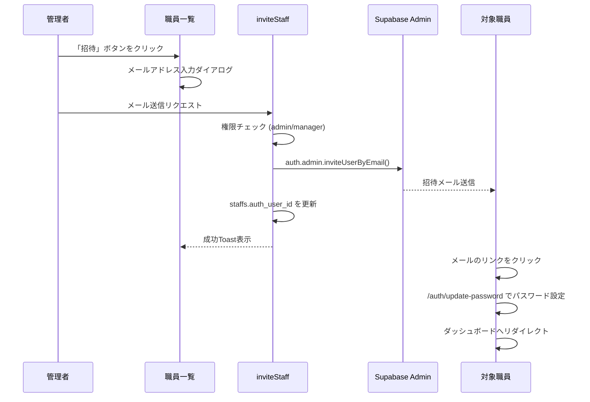

# スタッフ メール招待機能 実装完了

## 概要

既存の職員データを Supabase Auth と連携させ、管理者がメールで招待できる機能を実装しました。

## 作成・変更ファイル

### 新規作成

| ファイル | 説明 |
|---------|------|
| [admin.ts](file:///c:/Users/ktana/.gemini/antigravity/playground/infrared-rocket/lib/supabase/admin.ts) | Service Role クライアント |
| [admin-auth.ts](file:///c:/Users/ktana/.gemini/antigravity/playground/infrared-rocket/app/actions/admin-auth.ts) | `inviteStaff` Server Action |
| [invite-staff-dialog.tsx](file:///c:/Users/ktana/.gemini/antigravity/playground/infrared-rocket/app/(dashboard)/staffs/invite-staff-dialog.tsx) | 個別職員招待ダイアログ |
| [page.tsx](file:///c:/Users/ktana/.gemini/antigravity/playground/infrared-rocket/app/auth/update-password/page.tsx) | パスワード設定ページ |
| [update-password-form.tsx](file:///c:/Users/ktana/.gemini/antigravity/playground/infrared-rocket/app/auth/update-password/update-password-form.tsx) | パスワード設定フォーム |

### 変更

| ファイル | 変更内容 |
|---------|----------|
| [page.tsx](file:///c:/Users/ktana/.gemini/antigravity/playground/infrared-rocket/app/(dashboard)/staffs/page.tsx) | 「アカウント」列を追加、招待ボタン/登録済みバッジを表示 |

---

## 招待フロー



---

## 変更差分

### app/(dashboard)/staffs/page.tsx

render_diffs(file:///c:/Users/ktana/.gemini/antigravity/playground/infrared-rocket/app/(dashboard)/staffs/page.tsx)

---

## 検証結果

### ビルド
```
✓ Compiled successfully
✓ Generating static pages (11/11)
Exit code: 0
```

### 新規ルート
- `/auth/update-password` が正常に生成されました

---

## 動作確認手順

1. **環境変数の設定**
   ```
   SUPABASE_SERVICE_ROLE_KEY=your-service-role-key
   ```

2. **職員一覧で確認**
   - `auth_user_id` が `null` の職員に「招待」ボタンが表示される
   - 既にアカウントがある職員には「✅ 登録済み」バッジが表示される

3. **招待メール送信**
   - 「招待」ボタンをクリック
   - メールアドレスを入力して送信
   - Toastで「招待メールを送信しました」と表示

4. **パスワード設定**
   - 招待メールのリンクから `/auth/update-password` へ
   - 新パスワードを入力して確定
   - ダッシュボードへリダイレクト

---

## 注意事項

> [!IMPORTANT]
> Supabaseのメール送信設定（SMTP）が必要です。
> 未設定の場合、招待メールは送信されません（Auth Logsで確認可能）。
