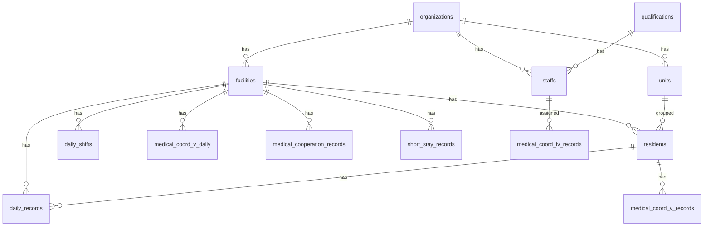

# 技術監査レポート (Technical Audit Report)
**作成日**: 2026-01-13  
**対象プロジェクト**: Infrared Rocket (障害福祉サービス請求・予実管理SaaS)

---

## 1. プロジェクト概要とスタック

### Tech Stack

| カテゴリ | 技術 | バージョン |
|---------|------|-----------|
| **Framework** | Next.js | 16.1.1 |
| **Runtime** | React | 19.2.3 |
| **Language** | TypeScript | 5.x |
| **Database** | Supabase (PostgreSQL) | - |
| **ORM / Client** | @supabase/supabase-js | 2.89.0 |
| **UI Library** | Radix UI | 各種 |
| **CSS** | TailwindCSS | 4.x |
| **Form** | react-hook-form + zod | 7.69.0 / 4.2.1 |
| **Table** | @tanstack/react-table | 8.21.3 |
| **PDF Export** | @react-pdf/renderer | 4.3.2 |
| **Error Tracking** | Sentry | 10.32.1 |
| **Date Utils** | date-fns | 4.1.0 |

### ディレクトリ構造（主要）

```
infrared-rocket/
├── app/
│   ├── (auth)/           # 認証関連ページ
│   ├── (dashboard)/      # ダッシュボード（主要機能）
│   │   ├── daily-reports/
│   │   ├── medical-cooperation/
│   │   ├── medical-v/
│   │   ├── residents/
│   │   ├── staffs/
│   │   ├── facilities/
│   │   ├── hq/           # 本社確認画面
│   │   └── settings/
│   ├── actions/          # Server Actions（22ファイル）
│   └── invite/           # 招待リンク処理
├── components/
│   ├── features/         # 機能別コンポーネント
│   │   ├── daily-report/ # (13ファイル)
│   │   ├── medical-cooperation/
│   │   └── medical-v/
│   ├── ui/               # 共通UIコンポーネント (24ファイル)
│   ├── dashboard/
│   ├── hq/
│   └── providers/
├── lib/                  # ユーティリティ
│   ├── supabase/         # Supabase クライアント
│   ├── auth-guard.ts     # 認証ガード
│   └── logger.ts
├── types/
│   ├── database.ts       # Supabase生成型
│   └── index.ts          # アプリ用型定義
└── supabase/
    └── migrations/       # 47 マイグレーションファイル
```

### 現在のフェーズ

| 状態 | 機能 |
|------|------|
| ✅ 完了 | 認証（Login/Logout）、施設切替、マスタ管理（利用者/職員/施設/ユニット）|
| ✅ 完了 | 業務日誌（入力/保存/バリデーション）、短期入所記録 |
| ✅ 完了 | 医療連携Ⅳ・Ⅴ（Grid入力/計算ロジック）|
| ✅ 完了 | 本社日次確認画面（CSV突合、入院/外泊管理）|
| 🔧 調整中 | Medical V 永続化（最近修正）、RLSポリシー最適化 |

---

## 2. データベース設計とデータモデル

### 主要テーブル定義（`types/database.ts` 及び migrations より）



| テーブル | 主要カラム | 用途 |
|----------|-----------|------|
| `organizations` | id, name, code | マルチテナントルート |
| `facilities` | id, organization_id, name, code, settings (JSONB) | 施設マスタ |
| `staffs` | id, organization_id, facility_id, role, qualification_id | 職員マスタ |
| `residents` | id, facility_id, unit_id, sputum_suction, care_level | 利用者マスタ |
| `daily_records` | organization_id, facility_id, resident_id, date, data (JSONB) | 日誌データ（正規化+JSONB併用） |
| `daily_shifts` | facility_id, date, night_shift_plus, night_staff_ids | 日勤/夜勤シフト |
| `medical_coord_v_records` | organization_id, resident_id, staff_id, date, care_contents (JSONB) | 医療連携Ⅴ記録 |
| `medical_coord_iv_records` | organization_id, staff_id, date, assigned_resident_count | 医療連携Ⅳ記録 |
| `short_stay_records` | facility_id, resident_id, date, meal_*, is_gh* | 短期入所記録 |
| `units` | organization_id, name, display_order | ユニット分類 |

### 設計の意図

1. **マルチテナント対応**: `organization_id` を上位キーとして全テーブルに伝播。RLSで組織単位のアクセス制御。
2. **JSONB活用**: `daily_records.data` にバイタル・食事・活動等の柔軟なフィールドを格納。スキーマ変更なしで拡張可能。
3. **正規化バランス**: 頻繁にクエリされるフラグ（`meal_breakfast` 等）は `short_stay_records` ではカラム化、`daily_records` では JSONB 内に統合。

---

## 3. アーキテクチャと堅牢性 (Robustness)

### データ取得・更新フロー（Server Actions 実装例）

**ファイル**: `app/actions/daily-record.ts`

```typescript
export async function upsertDailyRecords(records: DailyRecordInput[], facilityIdOverride?: string) {
    try {
        await protect()  // ① 認証ガード

        const staff = await getCurrentStaff()
        if (!staff) return { error: 'Unauthorized' }  // ② 権限チェック

        let facilityId = staff.facility_id
        if (staff.role === 'admin' && facilityIdOverride) {
            facilityId = facilityIdOverride  // ③ Admin の施設オーバーライド
        }

        if (!facilityId) {
            return { error: 'Facility context required' }  // ④ バリデーション
        }

        const supabase = await createClient()
        // ... データ処理 ...

        const { error } = await supabase
            .from('daily_records')
            .upsert(upsertPayload, { onConflict: 'resident_id, date' })

        if (error) {
            logger.error('upsertDailyRecords failed', error)  // ⑤ エラーログ
            return { error: translateError(error.message) }  // ⑥ ユーザー向け翻訳
        }

        // ⑦ 監査ログ
        logOperation({
            organizationId: staff.organization_id,
            actorId: staff.id,
            targetResource: 'daily_record',
            actionType: 'UPDATE',
            details: { date: records[0].date, count: records.length, facilityId }
        })

        revalidatePath('/daily-reports')
        return { success: true }
    } catch (e) {
        logger.error('Unexpected error in upsertDailyRecords', e)
        return { error: '予期せぬエラーが発生しました' }  // ⑧ グローバルキャッチ
    }
}
```

**実装パターン評価**:
- ✅ `protect()` による認証必須化
- ✅ `getCurrentStaff()` によるコンテキスト取得と権限チェック
- ✅ ログ出力 (`logger.error`, `logOperation`)
- ✅ エラー翻訳 (`translateError`)
- ✅ `try/catch` による例外ハンドリング
- ⚠️ 入力バリデーション: Zod スキーマは一部のみ（日誌入力は `lib/daily-report-validation.ts` で別実装）

### 認証・認可

**Middleware** (`middleware.ts`):
```typescript
export async function middleware(request: NextRequest) {
    return await updateSession(request)  // Supabase SSR セッション更新
}
```

**Auth Guard** (`lib/auth-guard.ts`):
- `protect()`: 認証チェック + `organization_id` 取得
- `requireRole(allowedRoles)`: ロールベースアクセス制御

**RLS (Row Level Security)**:
- `my_org_id()`: 現在ユーザーの組織ID取得関数
- `is_org_admin(org_id)`: 管理者権限チェック関数
- `can_access_facility(fid)`: 施設アクセス権限判定関数
- 全主要テーブルにRLS有効化済み

### 型安全性

**評価**: ⚠️ 中程度

| 項目 | 状態 |
|------|------|
| `any` 使用箇所 | **約48箇所** |
| 主な使用場所 | `hq/get-hq-daily-data.ts` (多数), `staffs/actions.ts`, フォームダイアログ |
| `database.ts` | ✅ Supabase CLI で生成済み、型定義完備 |
| `types/index.ts` | ✅ アプリ用カスタム型定義あり |

---

## 4. 機能実装状況 (Feature Audit)

| 機能カテゴリ | サブ機能 | 状態 | 備考 |
|-------------|---------|------|------|
| **認証** | Login | ✅ 完了 | Supabase Auth |
| | Logout | ✅ 完了 | |
| | Password Reset | ❓ 未確認 | 専用ページなし（Supabase標準に依存か）|
| | 招待リンク | ✅ 完了 | `app/invite/[token]` |
| **マスタ管理** | 利用者 (Residents) | ✅ 完了 | CRUD + unit_id |
| | 職員 (Staffs) | ✅ 完了 | CRUD + 資格連携 |
| | 施設 (Facilities) | ✅ 完了 | Admin 専用 |
| | ユニット (Units) | ✅ 完了 | 新規追加 (2026/01/12) |
| **業務日誌** | 入力Grid | ✅ 完了 | `DailyReportGrid` |
| | 保存 | ✅ 完了 | `upsertDailyRecords` |
| | バリデーション | ✅ 完了 | 夜勤チェック、日中活動必須など |
| | 履歴 | ⚠️ 部分実装 | 利用者書類履歴のみ |
| **短期入所** | Grid入力 | ✅ 完了 | `ShortStayGrid` |
| | 保存 | ✅ 完了 | |
| **医療連携** | Ⅳ (訪問看護) | ✅ 完了 | 担当者数による自動判定 |
| | Ⅴ (医療的ケア) | ✅ 完了 | 最近永続化修正 |
| **本社確認** | CSV突合 | ✅ 完了 | `HqCheckMatrix` |
| | 入院/外泊管理 | ✅ 完了 | 期間自動計算 |
| **PDF/CSV出力** | PDF | ⚠️ 部分実装 | `@react-pdf/renderer` 導入済み |
| | CSV | ⚠️ 部分実装 | インポートのみ確認 |

---

## 5. コード品質と負債 (Quality & Debt)

### 5.1 放置された console.log

| ファイル | 行 | 内容 |
|----------|-----|------|
| `app/actions/resident.ts` | 56 | `console.log(\`Recalculated Medical V units...\`)` |
| `app/actions/medical-cooperation.ts` | 316 | `console.log('[MedicalCoop] Upserting payload:...')` |
| `app/actions/medical-cooperation.ts` | 326 | `console.log('[MedicalCoop] Upsert Success...')` |

> [!WARNING]
> 本番環境で個人情報を含むペイロードがログ出力される可能性があります。`logger.debug` への置換を推奨。

### 5.2 `any` 型の乱用

**問題箇所の例**:

```typescript
// app/actions/hq/get-hq-daily-data.ts
async function getHqDailyDataForFacilities(supabase: any, ...) { ... }
facilityStaffs?.forEach((s: any) => { ... })
residentDailyRecords.find((r: any) => r.date === dateStr)
```

```typescript
// app/(dashboard)/staffs/staff-form-dialog.tsx
currentStaff?: any;
initialData?: any;
```

**影響**:
- 型エラーがコンパイル時に検出されない
- IDE の補完・リファクタリング支援が効かない
- ランタイムエラーのリスク増加

### 5.3 危険なコードパターン

| パターン | 状態 | 備考 |
|----------|------|------|
| `dangerouslySetInnerHTML` | ✅ 未使用 | XSSリスクなし |
| ハードコードされた値 | ⚠️ 少数 | 一部ロジックに数値直書き |
| 不適切な useEffect 依存配列 | ❓ 要確認 | 38箇所の useEffect 使用を確認、個別精査が必要 |

### 5.4 パフォーマンス懸念

| 懸念事項 | 該当箇所 | 詳細 |
|----------|----------|------|
| **複数 useEffect** | `daily-report-grid.tsx` | 同一コンポーネントに4つの useEffect（99, 139, 146, 151行目）|
| **N+1リスク** | `get-hq-daily-data.ts` | ループ内での配列フィルタリングが多数 |
| **大量データ処理** | `HqCheckMatrix` | 月次全施設データを一度にフェッチ |

### 5.5 冗長性・重複コード

| 箇所 | 詳細 |
|------|------|
| `app/actions/auth.ts` と `lib/auth-helpers.ts` | `getCurrentStaff` が2箇所に存在（一方は dynamic import で呼び出し）|
| 各フォームダイアログ | `staff-form-dialog.tsx` と `resident-form-dialog.tsx` の構造がほぼ同一 |
| upsert ロジック | 各 action ファイルで類似の upsert + エラーハンドリングパターン |

### 5.6 未使用コードの可能性

| ファイル/機能 | 備考 |
|--------------|------|
| `report_entries` テーブル | 初期スキーマで作成されたが、現在は `daily_records` に統合済みの可能性 |
| `comments` テーブル | 初期設計にあるが、現在は `finding_comments` を使用 |
| `hq_hospitalization_periods` | 在籍確認で使用か、要確認 |

---

## 6. 要件定義との乖離リスク

### 当初要件（REQUIREMENTS.md より）

> "訪問看護・障害福祉サービスの請求および予実管理SaaS"
> "シンプルかつ堅牢"
> "多店舗展開対応"

### リスク評価

| リスク項目 | 評価 | 詳細 |
|-----------|------|------|
| **マルチテナント対応** | ✅ 良好 | `organization_id` による分離、RLS 完備 |
| **施設スケーラビリティ** | ⚠️ 要注意 | 本社確認画面で全施設データを一括取得。施設数増加時にパフォーマンス劣化の可能性 |
| **シンプルさ** | ⚠️ 複雑化傾向 | マイグレーション47ファイル、RLS修正が多数（緊急対応の痕跡）|
| **堅牢性** | ⚠️ 中程度 | エラーハンドリングは整備されているが、`any` 型使用で型安全性に課題 |

### 具体的な懸念点

1. **マイグレーション履歴の複雑さ**
   - `20260106020002_restore_rls.sql` から `20260106020015_comprehensive_fix.sql` まで、連続して RLS 修正が行われている
   - → スキーマ設計が安定していない可能性。テスト環境での十分な検証が必要

2. **施設ID依存コード**
   - 多くの処理で `facilityId` を動的に取得しているが、Admin の施設オーバーライドロジックが各アクションに分散
   - → 中央化されたアクセス制御層の検討を推奨

3. **PDF/CSV出力**
   - 要件に「PDF/CSV出力」とあるが、現状はCSVインポートと部分的なPDF機能のみ
   - → 請求書出力等の本格実装は未完了の可能性

---

## 7. 推奨アクション

### 優先度: 高

1. **console.log の削除**: 3箇所を `logger.debug` に置換または削除
2. **型安全性向上**: 主要ファイル（`get-hq-daily-data.ts`, フォームダイアログ）の `any` を具体型に置換
3. **パフォーマンス検証**: 本社確認画面の施設数増加シミュレーション

### 優先度: 中

4. **重複コードの統合**: 認証ヘルパーの一本化、フォームダイアログの共通化
5. **useEffect 依存配列のレビュー**: 不要な再レンダリングの特定と修正
6. **未使用テーブルの整理**: `report_entries`, `comments` テーブルの使用状況確認

### 優先度: 低

7. **マイグレーション整理**: 本番前にスキーマを統合した新規マイグレーションの検討
8. **PDF出力機能の完成**: 請求書・報告書のPDF生成機能

---

## 付録: ファイル参照リンク

- [package.json](file:///c:/Users/ktana/.gemini/antigravity/playground/infrared-rocket/package.json)
- [types/database.ts](file:///c:/Users/ktana/.gemini/antigravity/playground/infrared-rocket/types/database.ts)
- [types/index.ts](file:///c:/Users/ktana/.gemini/antigravity/playground/infrared-rocket/types/index.ts)
- [middleware.ts](file:///c:/Users/ktana/.gemini/antigravity/playground/infrared-rocket/middleware.ts)
- [lib/auth-guard.ts](file:///c:/Users/ktana/.gemini/antigravity/playground/infrared-rocket/lib/auth-guard.ts)
- [app/actions/daily-record.ts](file:///c:/Users/ktana/.gemini/antigravity/playground/infrared-rocket/app/actions/daily-record.ts)
- [app/actions/auth.ts](file:///c:/Users/ktana/.gemini/antigravity/playground/infrared-rocket/app/actions/auth.ts)
- [REQUIREMENTS.md](file:///c:/Users/ktana/.gemini/antigravity/playground/infrared-rocket/REQUIREMENTS.md)
